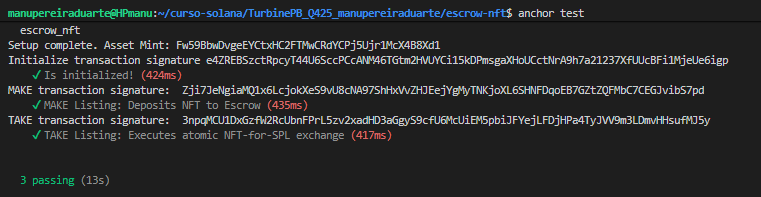
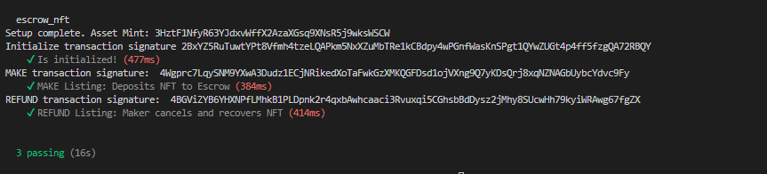

# Disco Exchange

**Disco Exchange** is a trustless, on-chain marketplace protocol built on **Solana** using the **Anchor Framework**.

Disco Exchange implements a secure **Escrow** mechanism specifically designed for **Metaplex Core Assets** and **SPL Token payments** (e.g., USDC, USDT, or custom tokens).

---

## Key Features

* **SPL Token Payments:** Sellers can list their assets for any specific SPL Token, not just native SOL.
* **Metaplex Core Support:** Fully compatible with the next-generation, low-cost Metaplex Core NFT standard.
* **Atomic Swaps:** The "Take" instruction ensures that the asset transfer and the payment happen in the exact same transaction. If one fails, everything reverts.
* **Program-Derived Custody:** Assets are held by a Program Derived Address (PDA), ensuring that no one (not even the marketplace admin) can touch them except the buyer or the original seller.

---

## Marketplace Lifecycle

The protocol operates through four distinct phases:

### 1. Initialization (`initialize`)
Before any trading happens, an escrow state account is initialized. This account acts as the source of truth, defining:
* The **Price** of the asset.
* The **Currency Mint** accepted for payment (e.g., the USDC Mint address).
* The **Maker** (Seller) authority.

### 2. Making an Offer (`make`)
The Seller deposits their NFT into the protocol.
* **Action:** The NFT ownership is transferred from the Seller to the Program's PDA.
* **Result:** The listing is now live. The asset is safely held by the program.

### 3. Taking the Offer (`take`)
A Buyer accepts the deal.
* **Action:** The Buyer sends the required SPL Tokens to the Seller.
* **Atomic Swap:** Simultaneously, the Program transfers the NFT from its custody to the Buyer.
* **Closure:** The escrow account is closed, and rent is recovered.

### 4. Refund (`refund`)
If the item hasn't sold, the Seller can cancel the listing.
* **Action:** The Program transfers the NFT back to the Seller.
* **Closure:** The escrow account is closed.

---

## Technical Architecture

### System Components
1.  **Disco Exchange Program:** The custom Anchor program orchestrating the logic.
2.  **Metaplex Core Program:** Manages the NFT assets and their ownership directly (no Token Accounts required for the program).
3.  **SPL Token Program:** Manages the fungible tokens (e.g., USDC) used for payments.

### Data Models & PDAs

#### 1. Escrow State (`EscrowState`)
The central account for a listing. It is a **Program Derived Address (PDA)** derived deterministically.

* **Seeds:** `[b"escrow", seed_u64]`
* **Function:** Acts as the **Authority** (signer) for the asset transfer and stores trade metadata.
* **State Structure:**
    ```rust
    pub struct EscrowState {
        pub seed: u64,            // Unique identifier
        pub maker: Pubkey,        // Seller's address
        pub nft_mint: Pubkey,     // Address of the NFT being sold
        pub currency_mint: Pubkey,// Address of the payment token
        pub price: u64,           // Listing price
        pub vault_ata: Pubkey,    // (Optional) Vault tracking
        pub escrow_bump: u8,      // PDA Bump seed
        pub fee_percent: u8,      // Marketplace fee
    }
    ```

#### 2. Asset Custody (Metaplex Core)
Unlike legacy NFTs, Metaplex Core assets are single accounts.
* **On List (`make`):** The program executes a CPI to Metaplex Core to change the asset's **owner** to the **Escrow PDA**.
* **On Buy (`take`):** The program signs with the PDA seeds to transfer ownership to the **Buyer**.

### Transaction Flow (Atomic Swap)

The **`take`** instruction executes the following logic in a single atomic transaction:

1.  **Verification:** Checks that the asset in the escrow matches the `nft_mint` in the state and that the payment token matches `currency_mint`.
2.  **Payment (CPI -> SPL Token):** Transfers `price` amount from Buyer's ATA -> Seller's ATA.
3.  **Asset Transfer (CPI -> Metaplex):** Transfers the NFT from Escrow PDA -> Buyer.
4.  **Cleanup:** Closes the `EscrowState` account and refunds the rent SOL to the Maker.

---

## Getting Started

### Prerequisites
* Node.js & NPM
* Rust & Cargo
* Solana CLI & Anchor

### Installation

1.  **Install dependencies:**
    ```bash
    npm install
    ```

2.  **Build the program:**
    ```bash
    anchor build
    ```

3.  **Run Integration Tests:**
    The test suite simulates the entire lifecycle: Creating a mock NFT, minting a mock payment token (like USDC), listing, buying, and refunding.
    ```bash
    anchor test
    ```

---

## Working Trial for PBQ4 Course

Evidence of successful implementation, compilation, and testing of the Disco Exchange protocol.

**Take Instruction:**


**Refund Instruction:**
